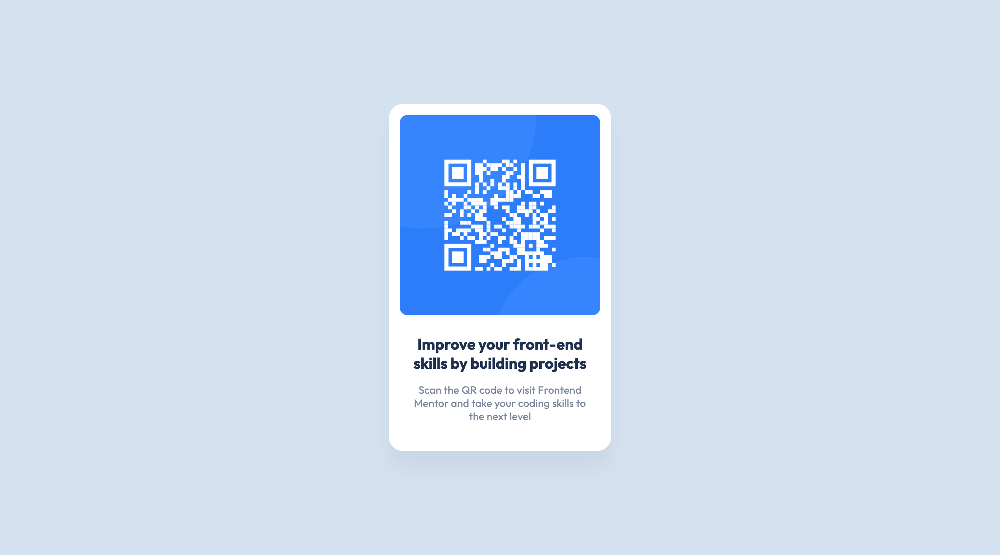

# Frontend Mentor - QR code component solution

This is a solution to the [QR code component challenge on Frontend Mentor](https://www.frontendmentor.io/challenges/qr-code-component-iux_sIO_H). Frontend Mentor challenges help you improve your coding skills by building realistic projects. 

## Table of contents

- [Frontend Mentor - QR code component solution](#frontend-mentor---qr-code-component-solution)
  - [Table of contents](#table-of-contents)
  - [Overview](#overview)
    - [The challenge](#the-challenge)
    - [Screenshot](#screenshot)
    - [Links](#links)
  - [My process](#my-process)
    - [Built with](#built-with)
  - [Author](#author)

## Overview

### The challenge

The challenge is to build out this QR code component and get it looking as close to the design as possible.

### Screenshot

### Links

- Solution URL: [https://www.frontendmentor.io/solutions/blog-card-preview-XhoM6wSddz](https://www.frontendmentor.io/solutions/blog-card-preview-XhoM6wSddz)
- Live Site URL: [https://mfrkankaya.github.io/blog-preview-card/](https://mfrkankaya.github.io/blog-preview-card/)

## My process

### Built with

- Semantic HTML5 markup
- CSS custom properties

## Author

- Website - [Furkan Kaya](https://fkaya.dev)
- Frontend Mentor - [@mfrkankaya](https://www.frontendmentor.io/profile/mfrkankaya)
- Twitter - [@mfrkankaya](https://www.twitter.com/mfrkankaya)
